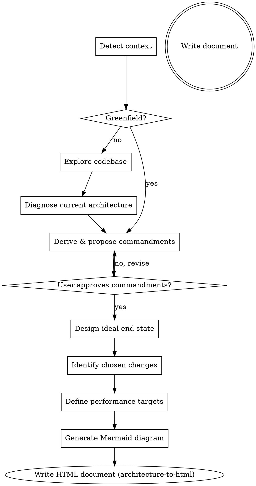
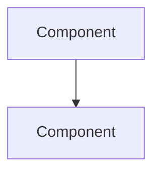

# Architecture Document

## Overview

Produces a comprehensive architecture document after brainstorming dialogue concludes. Handles both greenfield projects and existing codebases. Invoked in place of the write-design-doc step in `superpowers:brainstorming`.

## Checklist

Create a task for each phase and complete them in order:

1. **Detect context** — greenfield or existing codebase?
2. **Explore codebase** — read files, recent commits, existing docs (skip if greenfield)
3. **Diagnose current architecture** — for each pain point: name it, locate it (file/method/flow), describe what breaks and how often. No vague generalities. (Skip if greenfield, mark N/A)
4. **Derive & propose commandments** — 5–10 principles; HARD GATE: user must approve before continuing
5. **Design ideal end state** — every component, every data flow, every failure mode, stateful vs stateless boundaries. Specific enough that an engineer could start building without asking a single follow-up question.
6. **Surface ambiguities** — before writing design choices or migration path, list anything that is still underspecified. Ask the user to resolve each one. Do not proceed past assumptions.
7. **Identify genuine trade-offs** — only decisions with real, painful sacrifice. Each must have: what was chosen, what was given up, the concrete loss, and the future condition that would force reversal.
8. **Define migration path** — ordered steps with: what changes, what stays, rollback plan per step, and specific validation criteria that must pass before moving to the next step.
9. **Define performance targets** — specific numbers with units. No ranges. No "good enough." Each target must have a rationale tying it to a user-visible or system-critical outcome.
10. **Generate Mermaid diagram** — must show the happy path AND failure paths (retries, dead letters, fallbacks). code block + mermaid.live URL
11. **Design interactive demo** — plan the simulation before writing it: what flows to show, what state to animate, what fake data to use, how to trigger failure/retry paths
12. **Write the document** — use the `architecture-to-html` skill to write directly to `docs/architecture/YYYY-MM-DD-<topic>-architecture.html` (no markdown intermediary). The interactive demo is the last section, fully implemented in inline JS/CSS.

<HARD-GATE>
Do NOT proceed past step 4 until the user has explicitly approved the commandments. Present them, revise until approved, then continue.
</HARD-GATE>

## Process Flow



## Commandments Guidelines

Derive 5–10 commandments that reflect:
- Core architectural values (e.g. "Stateless over stateful", "Fail fast, recover gracefully")
- Constraints observed in the codebase or stated by the user
- Trade-offs that have already been decided

Present them numbered, each with a 2–3 sentence rationale explaining: what the principle enforces, why violating it would cause harm, and where in the system it applies most critically. Ask the user to approve, add, remove, or reword before proceeding.

## Mermaid Diagram

Generate a `flowchart TD` or `graph TD` showing components, relationships, and data flows.

Produce two outputs:

**1. Code block:**
````markdown

````

**2. Mermaid Live URL:**
Use bash to base64-encode the JSON payload and construct the link:
```bash
echo -n '{"code":"<escaped mermaid code>","mermaid":{"theme":"default"}}' | base64 | tr -d '\n'
```
Then construct: `https://mermaid.live/edit#base64:<encoded>`

## Document Output

**Do NOT write a markdown file.** Use the `architecture-to-html` skill to write the final document directly as HTML to `docs/architecture/YYYY-MM-DD-<topic>-architecture.html`.

The HTML document must contain these sections in order, each written with enough detail that an engineer could begin implementation without follow-up questions:

- **Overview & Context** — full description of the system/feature: what it does, why it's being built or changed, who uses it, what triggers this work, and what success looks like. Not a summary — a complete picture.
- **Current Architecture Diagnosis** — for each pain point: what it is, where it lives in the codebase, what breaks because of it, and how frequently. Include specific file names, method names, or data flows where known. (Greenfield: N/A)
- **Ideal End State** — concrete target architecture: every major component, how they communicate, what data flows where, what is stateful vs stateless, how it handles failure. An engineer reading this should be able to draw the system from scratch.
- **The Commandments** — numbered list, each with name and 2–3 sentence rationale (see Commandments Guidelines)
- **Design Choices & Trade-offs** — only include decisions where something real is being sacrificed. If a choice has no meaningful downside, it is not a design choice — leave it out. For each genuine trade-off: what was chosen, what viable alternative was given up, what you permanently lose by not choosing the alternative, and what future condition would force you to reverse this decision. The "what you lose" must be concrete and painful — not "slightly less convenient" but "we cannot do X without a rewrite" or "this will hurt us at Y scale." If you cannot name the loss, the decision does not belong here.
- **Migration Path** — ordered steps with enough detail to estimate effort: what changes, what stays, what the rollback plan is, and what the validation criteria are at each step.
- **Architecture Diagram** — `<div class="mermaid">` block + Mermaid Live link
- **Expected Performance** — table of Metric / Target / Rationale rows. Targets must be specific numbers, not ranges or "good enough."

- **Bidirectional beads link requirement** — the architecture doc and its beads doc MUST link to each other:

  - The **architecture HTML** includes a forward link near the top (right after the subtitle) pointing to its beads file:
    ```html
    <div class="forwardlink">→ <a href="<beads-filename>.html">Implementation beads</a></div>
    ```
  - The **beads HTML** includes a backlink in the same position pointing to the architecture file:
    ```html
    <div class="backlink">← <a href="<arch-filename>.html">Back to architecture spec</a></div>
    ```

  Style both to match the dark monospace theme: purple accent `#7c6af7` on the link, dotted underline, solid underline on hover.

**Depth standard:** After reading this document, an engineer should have zero unanswered questions about what is being built and why. If a decision is deferred, say so explicitly and state what information would resolve it. If you find yourself writing a vague sentence, stop — either make it specific or surface it as an open question for the user.

- **Interactive Demo** — the final section of every architecture document is a self-contained interactive demo of the system, built entirely in HTML/CSS/JS and embedded directly in the page. No external dependencies, no server required — it must run from a local `file://` URL. The demo should simulate the core user-facing or operator-facing flow of the system described: if it's a queue, show messages moving through it; if it's an API, show requests and responses; if it's a UI feature, show the UI. Use animation, state transitions, and realistic fake data to make it feel alive. The goal is that someone who has never read the document can watch the demo for 30 seconds and understand what the system does and why it matters. This is not a diagram — it is a working simulation. If the system has multiple flows (happy path, failure, retry), demo all of them with a way to trigger each. Label every element so the demo is self-explanatory without narration.

Invoke the `architecture-to-html` skill for CSS, Mermaid CDN handling, and the HTML shell template.
